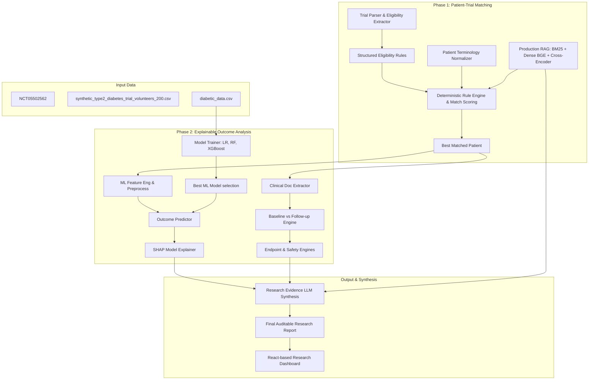

# Implementation Plan — AI Clinical Research Assistant

This document outlines the detailed architecture and implementation plan for building the AI Clinical Research Assistant, addressing all requirements of Phase 1 and Phase 2, including the evaluation suite.

## Goal Description

The project is an AI-powered Clinical Research Assistant with two phases:
1. **Phase 1 — Patient–Trial Matching**: Given a clinical trial identifier (`NCT05502562`), extract eligibility criteria and match/rank volunteers from `synthetic_type2_diabetes_trial_volunteers_200.csv` using a combination of sparse (BM25), dense (SentenceTransformers/BGE), terminology normalization, and deterministic rule evaluation.
2. **Phase 2 — AI Clinical Outcome Analysis**: Predict clinical outcomes for the matched patient using historical data from `diabetic_data.csv` via trained ML models (Logistic Regression, Random Forest, XGBoost). Explain predictions with SHAP. Evaluate patient outcomes using baseline-to-followup reports, deterministic endpoint checks, safety profiling, and evidence synthesis.

Additionally, a comprehensive evaluation suite will be implemented using Pytest and RAG/ML metrics.

---

## Architecture & Workflow

The architecture separating LLM understanding, retrieval, deterministic execution, and ML prediction:



---

## Proposed Changes

We will create a structured project inside the workspace `F:\PEC_Hack` following the recommended backend and frontend layout.

### Backend Component (`backend/`)

#### [`NEW`] `backend/app/main.py`
The FastAPI application entry point, setting up CORS, registering router endpoints (`/api/trials`, `/api/matching`, `/api/ml`, `/api/analysis`, `/api/research`), and serving static files if needed.

#### [`NEW`] `backend/app/api/`
API Route controllers:
- `trial_routes.py`: Handling trial parsing and structured extraction.
- `patient_routes.py`: Providing patient data profiles and listings.
- `matching_routes.py`: Initiating patient-trial matches and listing candidate rankings.
- `analysis_routes.py`: Extracting follow-up clinical reports, baseline-to-followup change calculations, safety analysis, and endpoint achievements.
- `research_routes.py`: Generating the final evidence-grounded research report.

#### [`NEW`] `backend/app/services/`
Core services implementing business logic:
- `trial_parser.py`: Extracted eligibility and outcome structures from the trial file.
- `eligibility_service.py`: Building the rule base (e.g., HbA1c threshold, age checks).
- `patient_matching_service.py`: Multi-component scoring (Compatibility + Similarity + Completeness).
- `ml_service.py`: Model registry, pipeline preparation, training (Logistic Regression, Random Forest, XGBoost), and inference.
- `shap_service.py`: SHAP calculations and plot coordinate generation.
- `endpoint_service.py`: Evaluating observed changes against trial endpoints.
- `safety_service.py`: Adverse event categorization and seriousness checks.
- `rag_service.py`: Local vector store (using numpy-based cosine similarity with `sentence-transformers` and `turbovec`) and BM25 search.

#### [`NEW`] `backend/app/ml/`
Scripts for dataset management and training:
- `preprocess.py`: Patient-level split, scaling, and categorical encoding.
- `train.py`: Automated model cross-validation, selection, and metadata logging.

---

### Frontend Component (`frontend/`)

We will build a React dashboard in the `frontend/` directory (using Vite, TS, and standard component-driven layouts) to visualize:
1. **Trial View**: Visualizing condition, inclusion/exclusion, and endpoints.
2. **Matching Ranker**: Patient table with status, match scores, passed/failed/unknown counts, and manual review highlights.
3. **Clinical Timeline**: Charts tracking HbA1c, Weight, and Blood Pressure from Baseline to Follow-up.
4. **ML Predictor**: Comparative ROC-AUC/PR-AUC metrics, outcome prediction, and a visual SHAP bar chart.
5. **Research Synthesis**: The auditable final report showing evidence sources.

---

### Evaluation Component (`tests/` and `evals/`)

#### [`NEW`] `tests/test_rule_engine.py`
Validating deterministic eligibility outcomes (PASS, FAIL, UNKNOWN) on edge-case synthetic patients.

#### [`NEW`] `tests/test_ml_pipeline.py`
Verifying target definitions, feature preprocessing, leak prevention, model training, and metrics calculations.

#### [`NEW`] `tests/test_rag_observe.py`
Implementing verification checks to ensure retrieved evidence is strictly aligned, and that missing values trigger UNKNOWN statuses.

---

## Verification Plan

### Automated Tests
Execute pytest suite from workspace:
```bash
pytest -v backend/tests/
```

### Manual Verification
1. Run the FastAPI backend:
   ```bash
   uvicorn backend.app.main:app --reload --port 8000
   ```
2. Run the frontend development server:
   ```bash
   npm run dev
   ```
3. Verify through dashboard that matching a volunteer updates the baseline-to-followup dashboard and shows the ML prediction + SHAP explanation.
